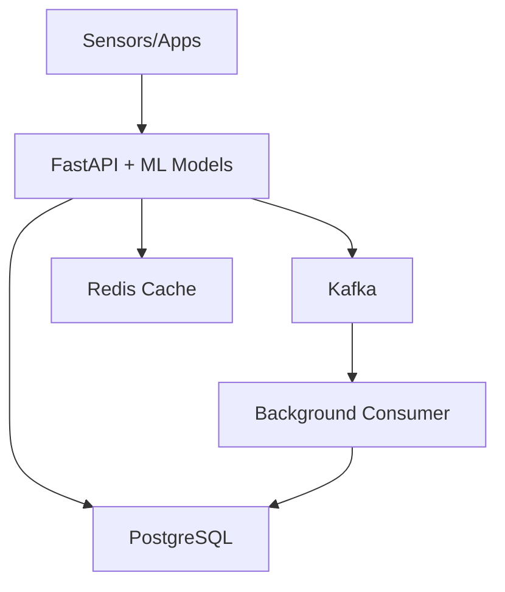

# Quick Deployment Guide
## Simple Scalable FastAPI + Kafka + ML System

### Overview
Deploy your landslide flood warning system with ML predictions in 1 week using free cloud tiers.

## Architecture Summary



**Key Features:**
- Handle 1000+ concurrent requests
- Real-time ML predictions for landslide/flood detection
- Kafka for async processing
- Redis caching for performance
- PostgreSQL for data storage

## Quick Start (Local Development)

### 1. Clone and Setup
```bash
git clone your-repo
cd landside_flood_warning_system
```

### 2. Docker Compose (All Services)
```yaml
# docker-compose.yml
version: '3.8'
services:
  api:
    build: ./api
    ports: ["8000:8000"]
    depends_on: [kafka, postgres, redis]
    
  kafka:
    image: confluentinc/cp-kafka:latest
    environment:
      KAFKA_KRAFT_MODE: "true"
      # ... (your existing config)
      
  postgres:
    image: postgres:15
    environment:
      POSTGRES_DB: landslide_flood_db
      POSTGRES_USER: postgres
      POSTGRES_PASSWORD: password
      
  redis:
    image: redis:7-alpine
    
  consumer:
    build: ./consumer
    depends_on: [kafka, postgres]
```

### 3. Start Everything
```bash
docker-compose up -d
```

### 4. Test API
```bash
curl -X POST http://localhost:8000/v1/sensor-data \
  -H "Content-Type: application/json" \
  -H "X-API-Key: test-key" \
  -d '{"sensor_id": "TEST_001", "measurements": {"rainfall": 25.5}}'
```

## Cloud Deployment Options

### Option 1: AWS Free Tier
```bash
# Services to use:
- ECS Fargate (API containers)
- RDS PostgreSQL (free tier)
- ElastiCache Redis (free tier)
- EC2 t2.micro (Kafka)

# Estimated cost: $0-10/month
```

### Option 2: Azure Free Tier
```bash
# Services to use:
- Container Instances (API)
- Azure Database for PostgreSQL
- Azure Cache for Redis
- Virtual Machine (Kafka)

# Estimated cost: $0-15/month
```

### Option 3: GCP Free Tier
```bash
# Services to use:
- Cloud Run (API)
- Cloud SQL PostgreSQL
- Memorystore Redis
- Compute Engine (Kafka)

# Estimated cost: $0-12/month
```

## Production Checklist

### Before Deployment
- [ ] Environment variables configured
- [ ] Database schema created
- [ ] ML models trained and saved
- [ ] API keys generated
- [ ] Docker images built
- [ ] Health checks working

### Security Setup
- [ ] HTTPS enabled
- [ ] API key authentication
- [ ] Database passwords secured
- [ ] Network security groups configured
- [ ] Backup strategy implemented

### Performance Optimization
- [ ] Database indexes created
- [ ] Redis caching enabled
- [ ] Connection pooling configured
- [ ] ML model caching setup
- [ ] Load testing completed

## Scaling Strategy

### Phase 1: Single Instance (Week 1)
- 1 API instance
- 1 Kafka broker
- 1 Database
- Handle 1000+ requests/minute

### Phase 2: Horizontal Scaling (Month 2)
- 2-3 API instances with load balancer
- 3 Kafka brokers
- Database read replicas
- Handle 10,000+ requests/minute

### Phase 3: Multi-Region (Month 6)
- Deploy in multiple regions
- Cross-region database replication
- CDN for global access
- Handle 100,000+ requests/minute

## Monitoring (Simple)

### Health Checks
```python
# Built into FastAPI
@app.get("/health")
def health_check():
    return {
        "status": "healthy",
        "database": check_db_connection(),
        "kafka": check_kafka_connection(),
        "redis": check_redis_connection(),
        "ml_models": check_models_loaded()
    }
```

### Basic Metrics
- API response times
- Database query performance
- Kafka message throughput
- ML prediction accuracy
- Error rates

## Troubleshooting

### Common Issues
1. **Kafka connection failed**: Check network and ports
2. **Database slow**: Add indexes, check connection pool
3. **ML predictions slow**: Enable Redis caching
4. **High memory usage**: Optimize model loading
5. **API timeouts**: Increase worker processes

### Debug Commands
```bash
# Check container logs
docker-compose logs api
docker-compose logs kafka
docker-compose logs postgres

# Check database
docker exec -it postgres psql -U postgres -d landslide_flood_db

# Check Kafka topics
docker exec -it kafka kafka-topics --list --bootstrap-server localhost:9092

# Check Redis
docker exec -it redis redis-cli ping
```

## Cost Optimization

### Free Tier Limits
- **AWS**: 750 hours/month free compute
- **Azure**: $200 credit first month
- **GCP**: $300 credit first 3 months

### Cost-Saving Tips
1. Use managed services (less maintenance)
2. Auto-scale down during low traffic
3. Use spot instances for non-critical workloads
4. Monitor usage regularly
5. Set up billing alerts

## Support & Documentation

### API Documentation
- Swagger UI: `http://localhost:8000/docs`
- ReDoc: `http://localhost:8000/redoc`

### Key Files
- `architecture/SIMPLE_SCALABLE_API.md` - Main architecture
- `architecture/API_SPECIFICATIONS.md` - API endpoints
- `architecture/DATABASE_SCHEMA.md` - Database design
- `docker-compose.yml` - Local development setup

### Next Steps After Deployment
1. Collect real sensor data
2. Retrain ML models with actual data
3. Add more sophisticated features
4. Scale based on usage patterns
5. Add advanced monitoring if needed

This guide gets you from zero to production in 1 week with a scalable system that can grow with your needs.