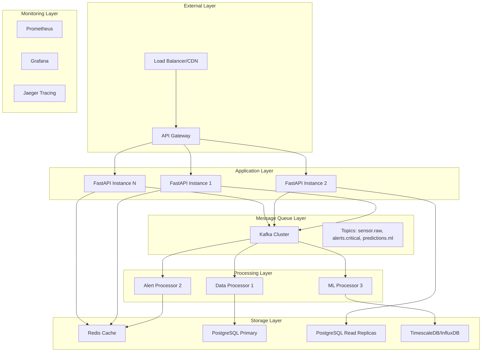

# Extremely Scalable Landslide Flood Warning System Architecture

## Overview
This architecture is designed to handle 10,000+ concurrent sensor data ingestion requests with real-time processing and global deployment capabilities using FastAPI and Kafka.

## System Architecture

## Core Components

### 1. API Gateway Layer
- **Technology**: Kong, AWS API Gateway, or Nginx
- **Purpose**: Rate limiting, authentication, request routing
- **Scaling**: Auto-scaling based on request volume
- **Features**:
  - Rate limiting: 1000 req/min per API key
  - Authentication: JWT tokens, API keys
  - Request/response transformation
  - Circuit breaker patterns

### 2. FastAPI Application Layer
- **Technology**: FastAPI with Uvicorn/Gunicorn
- **Scaling**: Horizontal auto-scaling (2-50 instances)
- **Features**:
  - Async request handling
  - Connection pooling
  - Health checks and metrics
  - Graceful shutdown

### 3. Kafka Message Queue Layer
- **Technology**: Apache Kafka with Confluent Platform
- **Configuration**:
  - 3-node cluster minimum
  - Replication factor: 3
  - Partitions: 12 per topic (for parallelism)
- **Topics**:
  - `sensor.raw`: Raw sensor data ingestion
  - `alerts.critical`: High-priority alerts
  - `predictions.ml`: ML model predictions
  - `notifications.outbound`: Notification requests

### 4. Data Processing Layer
- **Technology**: Python consumers with asyncio
- **Scaling**: Auto-scaling based on lag
- **Processors**:
  - **Data Validator**: Validates and enriches sensor data
  - **Alert Engine**: Processes predictions and generates alerts
  - **ML Processor**: Runs machine learning models
  - **Notification Handler**: Manages outbound notifications

### 5. Storage Layer
- **Primary Database**: PostgreSQL with read replicas
- **Cache**: Redis for session data and frequent queries
- **Time Series**: TimescaleDB for sensor data history
- **Object Storage**: S3/Azure Blob for ML models and logs

## Scalability Features

### Horizontal Scaling
- **API Instances**: Auto-scale from 2 to 50 instances
- **Kafka Partitions**: 12 partitions per topic for parallel processing
- **Database**: Read replicas for query distribution
- **Cache**: Redis cluster with sharding

### Performance Optimizations
- **Connection Pooling**: SQLAlchemy with async pools
- **Caching Strategy**: Multi-level caching (Redis + in-memory)
- **Batch Processing**: Bulk database operations
- **Async Processing**: Non-blocking I/O operations

### Global Distribution
- **Multi-Region Deployment**: AWS/Azure/GCP regions
- **CDN**: CloudFlare for static content
- **Database Replication**: Cross-region read replicas
- **Kafka Mirroring**: Cross-region data replication

## Technology Stack

### Core Services
- **API Framework**: FastAPI 0.104+
- **Message Queue**: Apache Kafka 3.5+
- **Database**: PostgreSQL 15+ with TimescaleDB
- **Cache**: Redis 7+
- **Container**: Docker with multi-stage builds
- **Orchestration**: Kubernetes or Docker Swarm

### Monitoring & Observability
- **Metrics**: Prometheus + Grafana
- **Logging**: ELK Stack (Elasticsearch, Logstash, Kibana)
- **Tracing**: Jaeger or Zipkin
- **Health Checks**: Custom health endpoints

### Security
- **Authentication**: JWT tokens with refresh mechanism
- **Authorization**: Role-based access control (RBAC)
- **Encryption**: TLS 1.3 for all communications
- **Secrets**: HashiCorp Vault or cloud secret managers

## Deployment Strategy

### Container Strategy
- **Base Images**: Python 3.11-slim
- **Multi-stage builds**: Separate build and runtime stages
- **Security**: Non-root users, minimal attack surface
- **Size Optimization**: Layer caching and minimal dependencies

### Cloud Deployment Options

#### AWS Free Tier Compatible
- **Compute**: ECS Fargate (free tier)
- **Database**: RDS PostgreSQL (free tier)
- **Cache**: ElastiCache Redis (free tier)
- **Message Queue**: MSK (Managed Kafka) or self-hosted
- **Load Balancer**: Application Load Balancer

#### Azure Free Tier Compatible
- **Compute**: Container Instances
- **Database**: Azure Database for PostgreSQL
- **Cache**: Azure Cache for Redis
- **Message Queue**: Event Hubs or self-hosted Kafka
- **Load Balancer**: Azure Load Balancer

#### GCP Free Tier Compatible
- **Compute**: Cloud Run
- **Database**: Cloud SQL PostgreSQL
- **Cache**: Memorystore for Redis
- **Message Queue**: Pub/Sub or self-hosted Kafka
- **Load Balancer**: Cloud Load Balancing

## Performance Targets

### Throughput
- **API Requests**: 10,000+ concurrent requests
- **Message Processing**: 100,000+ messages/second
- **Database Operations**: 50,000+ queries/second
- **Cache Operations**: 1,000,000+ operations/second

### Latency
- **API Response**: < 100ms (95th percentile)
- **Message Processing**: < 500ms end-to-end
- **Database Queries**: < 50ms (95th percentile)
- **Cache Access**: < 1ms (99th percentile)

### Availability
- **System Uptime**: 99.9% availability
- **Recovery Time**: < 5 minutes
- **Data Durability**: 99.999999999% (11 9's)

## Cost Optimization

### Free Tier Utilization
- **AWS**: $0/month for first 12 months (within limits)
- **Azure**: $200 credit for first 30 days
- **GCP**: $300 credit for first 90 days

### Resource Optimization
- **Auto-scaling**: Scale down during low traffic
- **Spot Instances**: Use for non-critical workloads
- **Reserved Capacity**: Long-term cost savings
- **Resource Monitoring**: Continuous cost optimization

## Next Steps
1. Implement microservices architecture
2. Set up Kafka cluster with proper partitioning
3. Configure database with read replicas
4. Implement caching strategy
5. Set up monitoring and alerting
6. Create CI/CD pipelines
7. Deploy to multiple cloud providers