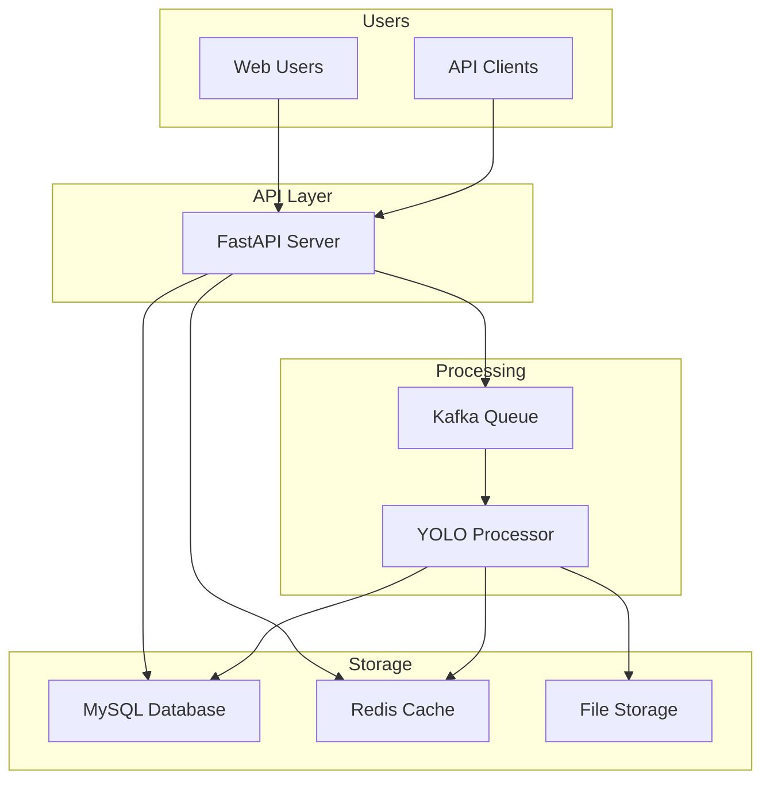

# Simple 1-Week Satellite Image Analysis Architecture
## FastAPI + MySQL + Kafka + Redis + YOLO

### Overview
A straightforward, scalable architecture for satellite image analysis that detects landslides and floods. Built with proven technologies and can handle high traffic while being simple to implement and maintain.

## Architecture Diagram



## Core Components

### 1. FastAPI Server
**What it does:** Handles all incoming requests for image analysis
- Receives satellite images from users
- Stores image metadata in database
- Sends images to processing queue
- Returns analysis results
- Manages API authentication

**Key Features:**
- Upload satellite images (single or batch)
- Get analysis results
- View active alerts
- Health monitoring

### 2. Kafka Queue
**What it does:** Manages background image processing
- Receives image processing requests from API
- Queues images for YOLO analysis
- Ensures no images are lost during processing
- Handles high volume of requests

**Topics:**
- `images.process` - Images waiting for analysis
- `results.ready` - Completed analysis results

### 3. YOLO Processor
**What it does:** Analyzes satellite images for landslides and floods
- Loads pre-trained YOLO model
- Processes images from Kafka queue
- Detects landslides and floods in images
- Calculates risk levels and probabilities
- Stores results back to database

**Output:**
- Landslide probability (0-100%)
- Flood probability (0-100%)
- Risk level (low/medium/high/critical)
- Detection coordinates on image

### 4. MySQL Database
**What it does:** Stores all application data
- Image metadata (filename, location, upload time)
- Analysis results (probabilities, detections)
- Alerts (active warnings for high-risk areas)
- API usage tracking

**Main Tables:**
- `images` - Uploaded satellite images
- `predictions` - YOLO analysis results
- `alerts` - Generated warnings

### 5. Redis Cache
**What it does:** Speeds up common requests
- Caches analysis results for identical images
- Stores API rate limiting data
- Caches frequently requested alerts
- Improves response times from seconds to milliseconds

### 6. File Storage
**What it does:** Stores actual image files
- Original uploaded satellite images
- Processed images with detection overlays
- Can use local storage or cloud storage (S3)

## How It Works

### Image Analysis Flow
1. **User uploads satellite image** → FastAPI receives image
2. **FastAPI saves image** → Stores file and metadata in database
3. **FastAPI queues processing** → Sends image to Kafka queue
4. **YOLO processor picks up image** → Analyzes for landslides/floods
5. **Results stored** → Saves analysis results to database and cache
6. **User gets results** → API returns analysis when requested

### Data Flow Example
```
Satellite Image Upload
        ↓
    FastAPI Server
        ↓
   MySQL (metadata) + Kafka (processing queue)
        ↓
   YOLO Processor
        ↓
   Analysis Results → MySQL + Redis Cache
        ↓
   User Gets Results via API
```

## API Endpoints (Simple)

```
POST /upload          - Upload satellite image for analysis
GET  /results/{id}     - Get analysis results for image
GET  /alerts           - Get active landslide/flood alerts
GET  /health           - Check system status
```

## Database Schema (Simplified)

```sql
-- Images table
CREATE TABLE images (
    id INT PRIMARY KEY AUTO_INCREMENT,
    filename VARCHAR(255),
    latitude DECIMAL(10,8),
    longitude DECIMAL(11,8),
    uploaded_at TIMESTAMP,
    status ENUM('processing', 'completed', 'failed')
);

-- Predictions table
CREATE TABLE predictions (
    id INT PRIMARY KEY AUTO_INCREMENT,
    image_id INT,
    landslide_probability DECIMAL(5,2),
    flood_probability DECIMAL(5,2),
    risk_level ENUM('low', 'medium', 'high', 'critical'),
    processed_at TIMESTAMP
);

-- Alerts table
CREATE TABLE alerts (
    id INT PRIMARY KEY AUTO_INCREMENT,
    latitude DECIMAL(10,8),
    longitude DECIMAL(11,8),
    alert_type ENUM('landslide', 'flood'),
    severity ENUM('low', 'medium', 'high', 'critical'),
    message TEXT,
    created_at TIMESTAMP,
    expires_at TIMESTAMP
);
```

## Technology Stack

- **FastAPI** - Modern, fast Python web framework
- **MySQL** - Reliable database for structured data
- **Kafka** - Message queue for background processing
- **Redis** - In-memory cache for speed
- **YOLO** - AI model for object detection in images
- **Docker** - Containerization for easy deployment

## Deployment (Docker Compose)

```yaml
version: '3.8'
services:
  api:
    build: ./api
    ports:
      - "8000:8000"
    depends_on:
      - mysql
      - redis
      - kafka

  yolo-processor:
    build: ./yolo
    depends_on:
      - kafka
      - mysql

  mysql:
    image: mysql:8.0
    environment:
      MYSQL_ROOT_PASSWORD: password
      MYSQL_DATABASE: satellite_analysis

  redis:
    image: redis:alpine

  kafka:
    image: confluentinc/cp-kafka:latest
    environment:
      KAFKA_ZOOKEEPER_CONNECT: zookeeper:2181
      KAFKA_ADVERTISED_LISTENERS: PLAINTEXT://kafka:9092
```

## Performance Expectations

- **Handle 1,000+ image uploads per hour**
- **Process images in 30-60 seconds**
- **API response time under 100ms for cached results**
- **99% uptime with proper deployment**
- **Scales horizontally by adding more processors**

## Why This Architecture Works

### Simple but Scalable
- Each component has a single responsibility
- Easy to understand and maintain
- Can scale individual components as needed

### Reliable
- Kafka ensures no images are lost
- Database stores all important data
- Redis provides fast access to results

### Fast
- Background processing doesn't block API
- Caching speeds up repeated requests
- Async processing handles multiple requests

### Cost-Effective
- Uses proven, open-source technologies
- Can run on modest hardware initially
- Scales up only when needed

## 1-Week Implementation Plan

**Day 1-2:** Set up FastAPI server with basic endpoints
**Day 3-4:** Integrate MySQL database and basic CRUD operations  
**Day 5:** Add Kafka for background processing
**Day 6:** Integrate YOLO model for image analysis
**Day 7:** Add Redis caching and final testing

This architecture gives you a production-ready system that's simple to build, easy to understand, and scales well as your needs grow.