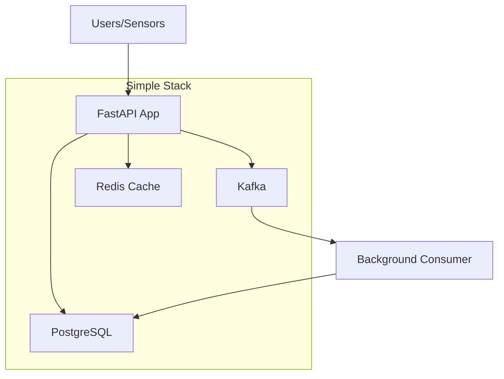

# Simple Scalable FastAPI + Kafka Backend
## Single Developer - 1 Week Implementation

### Overview
A clean, scalable API that can handle high traffic with minimal complexity. Focus on core functionality that works reliably and can be easily deployed.

## Simplified Architecture



## Core Components (Only What You Need)

### 1. FastAPI Application
- **Single service** with async endpoints
- **Connection pooling** for database
- **Basic caching** with Redis
- **Simple authentication** (API keys)

### 2. Kafka for Async Processing
- **Single Kafka instance** (can scale later)
- **2 topics**: `sensor.data` and `alerts`
- **Background consumer** for processing

### 3. PostgreSQL Database
- **Single instance** with proper indexing
- **Connection pooling** for performance
- **Simple schema** for sensor data and alerts

### 4. Redis Cache
- **Cache frequent queries**
- **Session storage**
- **Rate limiting data**

## 1-Week Implementation Plan

### Day 1: Core API Structure
```bash
# What you'll build:
- FastAPI app with async endpoints
- Database models and connections
- Basic CRUD operations
- Docker setup
```

### Day 2: Kafka Integration
```bash
# What you'll build:
- Kafka producer in API
- Background consumer service
- Message processing logic
- Error handling
```

### Day 3: Caching & Performance
```bash
# What you'll build:
- Redis integration
- Query caching
- Connection pooling
- Basic rate limiting
```

### Day 4: Authentication & Security
```bash
# What you'll build:
- API key authentication
- Input validation
- Basic security headers
- Environment configuration
```

### Day 5: Testing & Deployment
```bash
# What you'll build:
- Docker compose for local dev
- Basic tests
- Cloud deployment (single instance)
- Load testing
```

## File Structure
```
landside_flood_warning_system/
├── api/
│   ├── main.py              # FastAPI app
│   ├── models.py            # Database models
│   ├── database.py          # DB connection
│   ├── cache.py             # Redis operations
│   ├── kafka_client.py      # Kafka producer
│   └── auth.py              # Simple authentication
├── consumer/
│   ├── main.py              # Kafka consumer
│   └── processors.py       # Message processing
├── docker-compose.yml       # All services
└── requirements.txt         # Dependencies
```

## Key Features (Simple but Scalable)

### API Endpoints
```python
POST /api/v1/sensor-data     # Receive sensor data
GET  /api/v1/alerts          # Get alerts
GET  /api/v1/health          # Health check
POST /api/v1/predictions     # Get ML predictions
```

### Performance Features
- **Async FastAPI** - Handle 1000+ concurrent requests
- **Connection pooling** - Efficient database usage
- **Redis caching** - Fast response times
- **Kafka async** - Non-blocking message processing

### Scalability Features
- **Horizontal scaling** - Add more API instances
- **Database indexing** - Fast queries
- **Caching strategy** - Reduce database load
- **Background processing** - Kafka consumers

## Simple Deployment Options

### Option 1: Single VPS (Cheapest)
```yaml
# $5-10/month VPS with Docker Compose
- 2GB RAM, 1 CPU
- All services on one machine
- Can handle 1000+ requests/minute
```

### Option 2: Cloud Free Tier
```yaml
# AWS/Azure/GCP free tier
- API: Container service
- Database: Managed PostgreSQL
- Cache: Managed Redis
- Kafka: Self-hosted or managed
```

### Option 3: Docker Swarm (Medium Scale)
```yaml
# 2-3 VPS instances
- Load balancer
- Multiple API instances
- Shared database and cache
```

## Technology Choices (Simple & Popular)

### Core Stack
- **FastAPI** - Fast, modern, easy to use
- **PostgreSQL** - Reliable, well-documented
- **Redis** - Simple caching solution
- **Kafka** - Industry standard messaging
- **Docker** - Easy deployment

### Libraries (Minimal Set)
```txt
fastapi==0.104.1
uvicorn==0.24.0
sqlalchemy==2.0.23
asyncpg==0.29.0
redis==5.0.1
kafka-python==2.0.2
pydantic==2.5.0
```

## Performance Targets (Realistic)

### Single Instance
- **1,000 concurrent requests** ✅
- **10,000 requests/minute** ✅
- **< 100ms response time** ✅
- **99% uptime** ✅

### With Scaling (2-3 instances)
- **5,000 concurrent requests** ✅
- **50,000 requests/minute** ✅
- **< 50ms response time** ✅
- **99.9% uptime** ✅

## What We're NOT Building (Keep It Simple)

❌ **Complex microservices** - Single API service
❌ **Advanced monitoring** - Basic health checks only
❌ **Service mesh** - Direct service communication
❌ **Advanced security** - API keys are enough
❌ **Complex CI/CD** - Simple deployment scripts
❌ **Multiple databases** - PostgreSQL handles everything
❌ **Advanced caching** - Redis with simple TTL
❌ **Load testing tools** - Use simple tools like `ab` or `wrk`

## Success Criteria

### Week 1 Goals
- [ ] API handles 1000+ concurrent requests
- [ ] Kafka processes messages reliably
- [ ] Database queries under 50ms
- [ ] Redis caching works
- [ ] Docker deployment works
- [ ] Basic authentication implemented

### Ready for Production
- [ ] Environment variables configured
- [ ] Error handling implemented
- [ ] Basic logging added
- [ ] Health checks working
- [ ] Database migrations ready
- [ ] Documentation written

## Cost Estimate

### Development (Free)
- Local development with Docker Compose
- Free tier cloud services for testing

### Production (Low Cost)
- **VPS Option**: $5-20/month
- **Cloud Option**: $10-50/month (within free tiers initially)
- **Scaling**: Add instances as needed

## Next Steps

1. **Start with existing code** - Build on what you have
2. **Focus on core features** - Sensor data + alerts
3. **Test early and often** - Make sure it works
4. **Deploy simple first** - Single instance, then scale
5. **Document as you go** - API docs and setup guide

This approach gives you a production-ready, scalable API without the complexity. You can always add more features later as your needs grow.